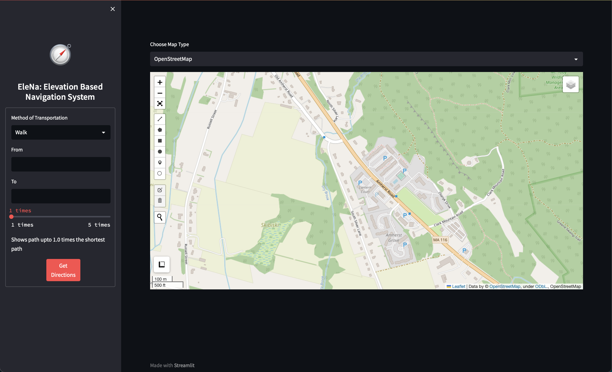
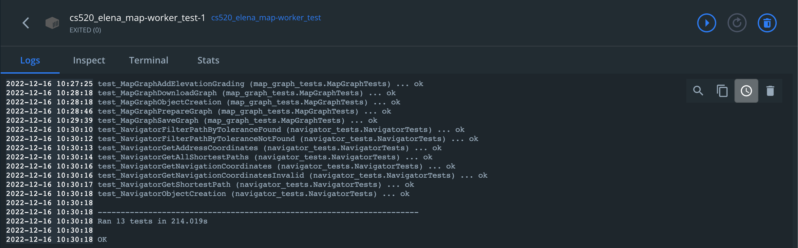
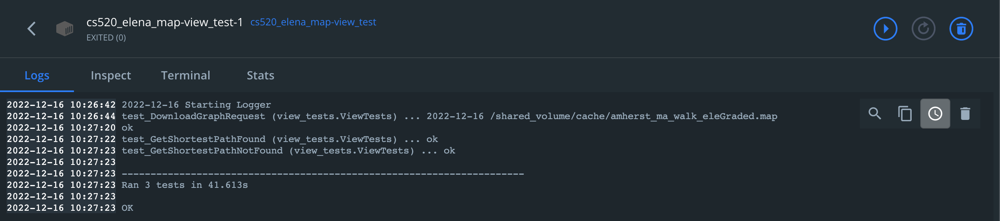

# Elevation-based Navigation System (EleNa)

## Authors:
- Mudit Chaudhary (32607978)
- Pragyanta Dhal (33069605)
- Ayushe Gangal (33018381)

## Introduction
EleNa is a web application providing elevation guided navigation i.e., it tries to minimize the elevation gain for
generating directions between the origin and destination on the map. The web application gives the user functionality to
choose the origin, destination, and tolerance (how much extra are they willing to walk for a lower elevation gain path).
The web application then provides the optimized route between the two addresses.
### Current constraints
Due to limited computational resources, we have the following constraints:
1. The origin and the destination addresses must be in the same city and state.
2. We limit the navigation to addresses in the USA.

## How to build and start the web application
The web application follows a MVC microservices architecture. Each microservice runs on a separate docker container. We 
use docker compose for container orchestration and build scripts. We have the following services (```docker_compose.yaml```):
1. view: Web application interface for the user.
2. worker: Handles map downloads, processing, and finding the shortest routes. This can be scaled to more workers to handle more demand.
3. load balancer: Handles load balancing to multiple workers from view using Nginx.
4. lru_cacher: Runs a cron job every midnight to delete least recently used caches for maps and graphs.

To build and deploy the app, the developer needs to have docker installed. The developer also need to add their Google Maps Elevation API key in ```worker/config.json```. More information
about how to generate API key [here](https://developers.google.com/maps/documentation/elevation/overview)
### Step 1: Build service
To build the service, developer need to be in the root directory with ```docker-compose.yaml```  
**Command**: ```docker compose build```

### Step 2: Start the service
To start the service, developer needs to specify the scaling factor for the worker. Scaling requires change in load balancer 
configuration; the required changes are specified in later sections. By default, we scale to 2 workers.  
**Command**: ```docker compose up --scale worker=2```  

### Step 3: Scale worker process (Optional)
To scale the workers, ```load_balancer/nginx.conf``` needs to be modified. For example, to scale to 2 workers (default), 
the configuration is:
```
events { worker_connections 1024; }

http {

    # List of application servers
    upstream api_servers {
        server cs520_elena_map-worker-1:9999;
        server cs520_elena_map-worker-2:9999;
    }


    # Configuration for the server
    server {

        # Running port
        # listen [::]:5100;
        listen 5100;

        # Proxying the connections
        location /download_graph {
            proxy_pass         http://api_servers/download_graph;
        }
        location /get_shortest_path {
            proxy_pass         http://api_servers/get_shortest_path;
        }

    }
}
```

To scale the service to 5 workers, the configuration needs to be modified to:
```
events { worker_connections 1024; }

http {

    # List of application servers
    upstream api_servers {
        server cs520_elena_map-worker-1:9999;
        server cs520_elena_map-worker-2:9999;
        server cs520_elena_map-worker-3:9999;
        server cs520_elena_map-worker-4:9999;
        server cs520_elena_map-worker-5:9999;
    }


    # Configuration for the server
    server {

        # Running port
        # listen [::]:5100;
        listen 5100;

        # Proxying the connections
        location /download_graph {
            proxy_pass         http://api_servers/download_graph;
        }
        location /get_shortest_path {
            proxy_pass         http://api_servers/get_shortest_path;
        }

    }
}
```

After modifying the configuration, we need to run the build command again specified in Step 1.
Then we deploy the service using a modified command specified in Step 2.  
**Command:** ```docker compose up --scale worker=5```  
**General command:** ```docker compose up --scale worker=<scaling factor>```  

### Step 4: Using the web application
The web application can be accessed on ```127.0.0.1:5100```. The screenshot below shows the expected interface.


### Step 5: To stop the service
**Command:** ```docker compose down```

## How to run unit tests
To run the tests with ease, we provide a separate docker compose file (```docker-compose_test.yaml``).
To run the tests, user needs to run:
1. ```docker compose -f docker_compose_test.yaml build```
2. ```docker compose -f docker_compose_test.yaml up --scale worker=2```

This will run two containers for testing the view (```cs520_elena_map-view_test-1```) and workers (```cs520_elena_map-worker_test-1```).
The unit tests result can be viewed in the logs of these containers using Docker GUI or command line. 
The unit test results are shown below.
**Worker tests**  
  
**View tests**  
  

Shut down the docker containers after tests are completed using: ```docker compose -f docker_compose_test.yaml down```

## Setup for API stress testing
We provide a separate docker compose (```docker_compose_stress_test.yaml```) for stress testing the worker internal API. It exposes the worker service on 
```127.0.0.1:5100``` with two available end points ```/download_graph``` and ```/get_shortest_path```.
To perform setup for stress tests, user needs to run:
1. ```docker compose -f docker_compose_stress_test.yaml build```
2. ```docker compose -f docker_compose_stress_test.yaml up --scale worker=2```

After that the user can use a stress tester (e.g., Apache JMeter) for performing the testing.

We provide example cURL commands for making requests to the worker API:  
- **/download_graph**  
```
curl -X POST 127.0.0.1:5100/download_graph -H 'Content-Type: application/json' -d '{"city":"Amherst", "state":"MA","transport_mode":"walk"}'
```  
- **/get_shortest_path**  
```
curl -X POST 127.0.0.1:5100/get_shortest_path -H 'Content-Type: application/json' -d '{"city":"Amherst", "state":"MA","transport_mode":"walk", "from_address":"Brett Hall, Amherst, MA", "to_address":"497 East Pleasant Street, Amherst, MA", "tolerance":20.0}'
```

Shut down the docker containers after stress tests are completed using: ```docker compose -f docker_compose_stress_test.yaml down```
